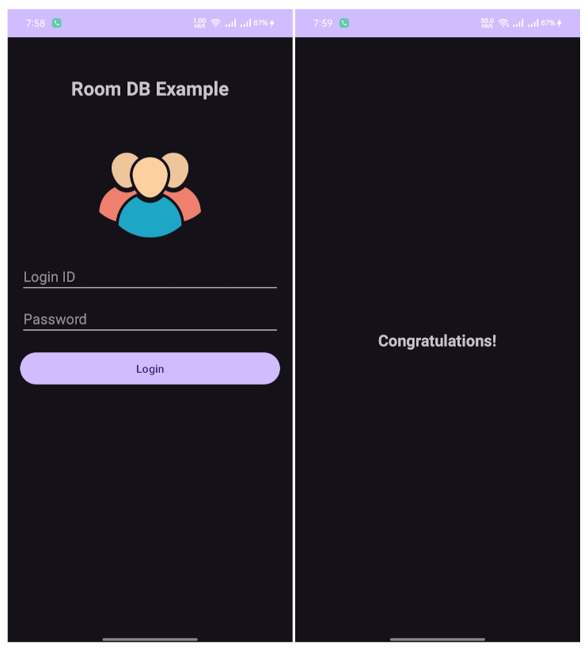

# RoomDbAndroid
Step-by-Step How-To: Setting Up and Implementing Room Database
<br><br>
***Introduction***

SQLite and Room are both database solutions for Android applications, but they serve different purposes and offer different features. While SQLite is a powerful and widely-used database engine, Room offers a higher-level abstraction, better developer experience, and improved support for modern Android development practices. Room is particularly 
beneficial for developers who prefer an ORM approach, value compile-time safety, and want to take advantage of the Android Architecture Components.

Room database has some extra advantages which SQLite do not provide, such as:

**Compile-Time Verification:** Room provides compile-time verification of SQL queries. If there are any issues with your queries, the compiler catches them during the build process, reducing the chance of runtime errors.

**LiveData and RxJava Integration:** Room integrates seamlessly with LiveData and RxJava. This allows you to observe changes in the database and automatically update the UI when the data changes, making it easier to implement reactive UIs.

Let's explore the power of Room database in a simple login application.


<br><br>

***Step 1: Add Room Database Dependencies***

In your app-level build.gradle file, add the following dependencies:
```
implementation "androidx.room:room-runtime:2.6.1"
annotationProcessor "androidx.room:room-compiler:2.6.1"
```
<br>

***Step 2: Create the Entity Class***

Define the structure of your User entity class, representing the user profile information.
```java
@Entity(tableName = "user_table")
public class User {
    @PrimaryKey(autoGenerate = true)
    public int id;

    @ColumnInfo(name = "login_id")
    public String loginId;

    @ColumnInfo(name = "full_name")
    public String fullName;

    @ColumnInfo(name = "contact")
    public String contact;
}

```
<br>

***Step 3: Create the DAO (Data Access Object)***

Define the Data Access Object interface to perform CRUD operations on the User entity.
```java
@Dao
public interface UserDao {
    @Insert
    void insert(User user);

    @Update
    void update(User user);

    @Delete
    void delete(User user);

    @Query("SELECT * FROM user_table WHERE id = :userId")
    User getUserById(int userId);

    @Query("SELECT * FROM user_table")
    List<User> getAllUsers();
}

```
<br>

***Step 4: Create the Room Database***

Build the Room Database by extending RoomDatabase and include the DAO.
```java
@Database(entities = {User.class}, version = 1, exportSchema = false)
public abstract class AppDatabase extends RoomDatabase {
    public abstract UserDao userDao();

    private static volatile AppDatabase INSTANCE;

    public static AppDatabase getDatabase(final Context context) {
        if (INSTANCE == null) {
            synchronized (AppDatabase.class) {
                if (INSTANCE == null) {
                    INSTANCE = Room.databaseBuilder(context.getApplicationContext(),
                            AppDatabase.class, "app_database")
                            .build();
                }
            }
        }
        return INSTANCE;
    }
}

```
<br>

***Step 5: Implement CRUD Operations in Your Application***

In your activities or fragments, use the UserDao methods to perform database operations.
<br><br>

***Step 6: Initialize the Database***

Initialize the database in your application class or the entry point of your app.
```java
public class MyApp extends Application {
    public static AppDatabase appDatabase;

    @Override
    public void onCreate() {
        super.onCreate();
        appDatabase = AppDatabase.getDatabase(this);
    }
}

```
